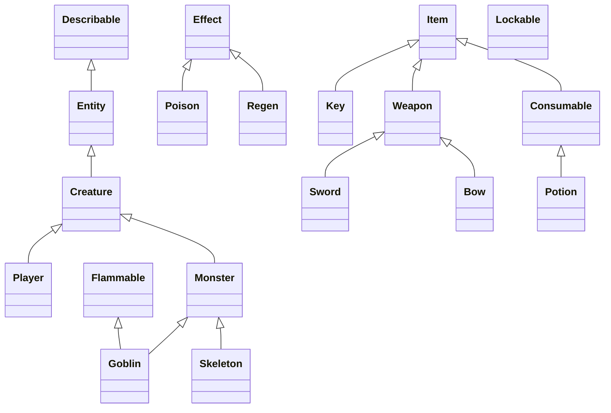

# Class Diagram — Inheritance

```mermaid
classDiagram
    Describable <|-- Entity
    Entity <|-- Creature
    Creature <|-- Player
    Creature <|-- Monster
    Monster <|-- Goblin
    Flammable <|-- Goblin
    Monster <|-- Skeleton

    Effect <|-- Poison
    Effect <|-- Regen

    Item <|-- Key
    Item <|-- Weapon
    Weapon <|-- Sword
    Weapon <|-- Bow
    Item <|-- Consumable
    Consumable <|-- Potion

    class Describable
    class Flammable
    class Lockable
```