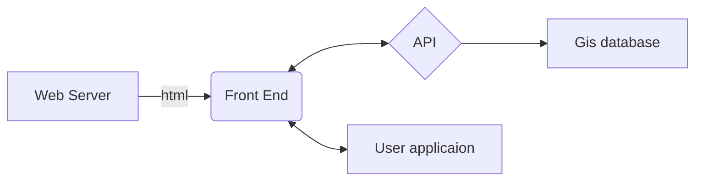
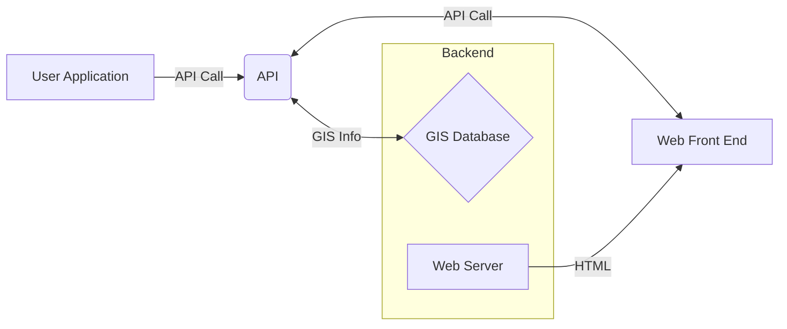

## mermade diagram challenge

```mermaid
flowchart LR
    A[Web Server] -->|html| B(Front End)
    B <--> C{API}
    C --> E[Gis database]
    B <--> F[User applicaion]
```

```mermaid
flowchart LR
    A[User Application] -->|API Call| B(API)
    B <-->|GIS Info| C{GIS Database}
    B <-->|API Call| F[Web Front End]

    subgraph BE[Backend]
        E[Web Server]
        C
    end

    E -->|HTML| F
```

