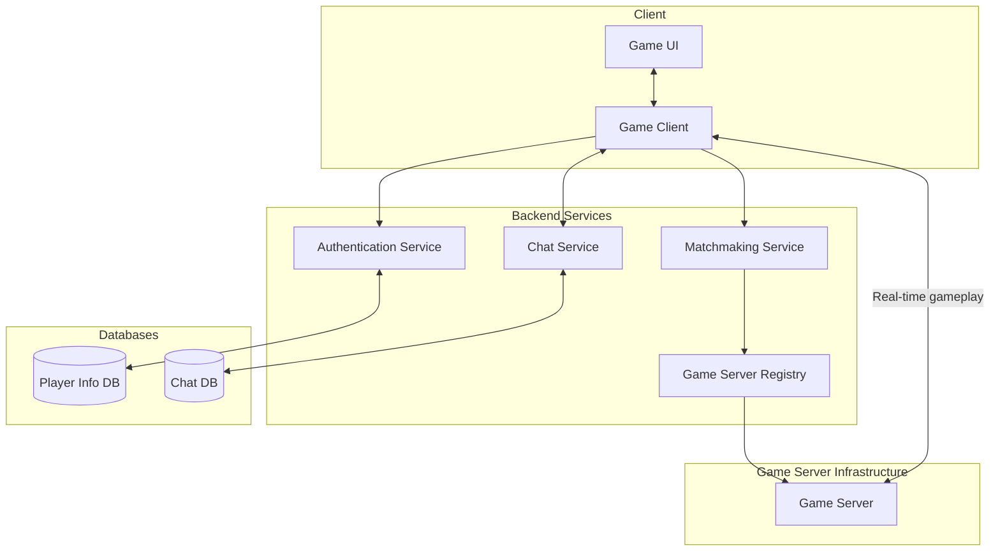

# component diagram

```mermaid

flowchart TB
    subgraph Client["Client"]
        UI["Game UI"]
        Game["Game Client"]
    end

    subgraph Backend["Backend Services"]
        Auth["Authentication Service"]
        Match["Matchmaking Service"]
        Registry["Game Server Registry"]
        Chat["Chat Service"]
    end

    subgraph GameServers["Game Server Infrastructure"]
        Server["Game Server"]
    end

    subgraph Databases["Databases"]
        PlayerDB[("Player Info DB")]
        ChatDB[("Chat DB")]
    end

    UI <--> Game
    Game --> Auth
    Auth <--> PlayerDB

    Game --> Match
    Match --> Registry
    Registry --> Server
    Game <-->|Real-time gameplay| Server

    Game <--> Chat
    Chat <--> ChatDB
```